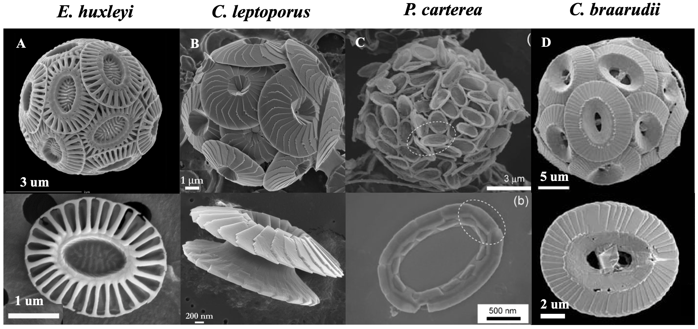

# Coccolithophores

Coccolithophores are unicellular algae that cover their cell wall with crystals of calcium carbonate. These crystals have complex morphologies that largely differ from synthetic grown calcite, which is isotropic. How the organism controls the crystal morphology remains a mistery.

Interesting papers on the topic:
*[Complex morphologies of biogenic crystals emerge from anisotropic growth of symmetry-related facets](https://www.science.org/doi/10.1126/science.abm1748)
*[Transport-Limited Growth of Coccolith Crystals](https://onlinelibrary.wiley.com/doi/10.1002/adma.202309547)